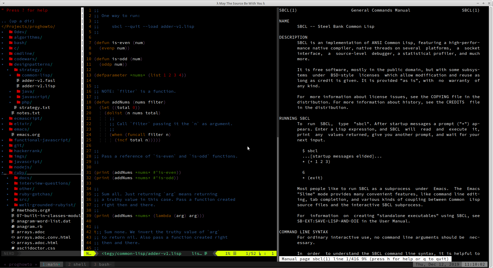
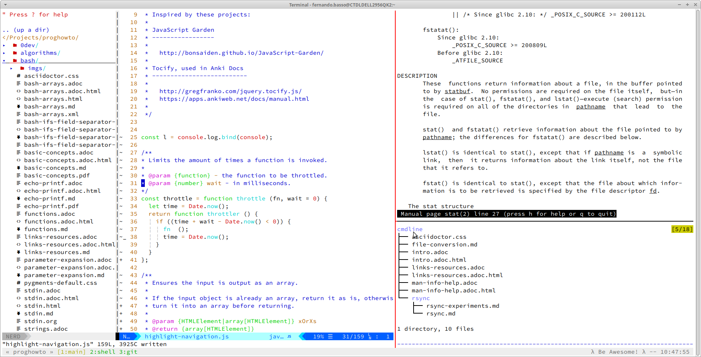

# Fernando Basso Dotfiles

## Instructions

- Clone the repo;
- Change to the cloned repository's directory;
- Do a dry run first (read the output carefully);
- Run it for real;

```bash
sudo pacman -S rsync --needed
git clone <this project> ~/Dotfiles
git clone https://github.com/FernandoBasso/dotfiles ~/Projects/
cd !$
bash sync.sh --dry-run

# Finally, if you are sure you'll not override files you don't mean to:
bash sync.sh --sync
```

NOTE: Every time a dotfile is to be edited, edit it (the file) from the repository's directory, then use `sync.sh` again to sync the changes to your `$HOME`. That is, do not edit, for instance, `~/.bashrc`. Rather, edit `~/Projects/dotfiles/.bashrc` and then:

```bash
bash ~/Projects/dotfiles/sync.sh --dry-run
bash ~/Projects/dotfiles/sync.sh --sync
```

## Setup Vim

Do the steps above and optionally install vim stuff:

```bash
bash ~/Projects/dotfiles/sync.sh --setup-vim
```

You may also run the above command every time you want to update Vim Plug and its managed packages.

TODO: Create a `setup_emacs` function since I use Emacs a lot as well.

## Notes

The directory `bin/` is not copied to `$HOME/bin/`. `bin/` is just added to `PATH` and `$HOME/bin` is left untouched because there is really no advantage in doing so. This way, `$HOME/bin/` can be used by any other things that should not be committed to the repository, like, third-party programs.


## Screenshots

### Tmux Dark Theme




### Tmux Light Theme



